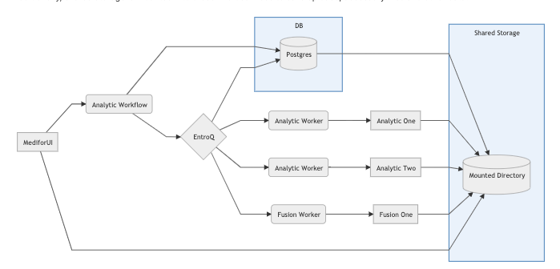

# MediFor How To

This repository is designed to give new developers and prospective transition partners an overview of the MediFor system so that they may extend the research in their own operational use cases.

## Understanding the MediFor System

The MediFor system is a distributed prototype allowing images and videos to be analyzed for “integrity”, which loosely translates to “trustworthiness” or “lack of manipulation”. It has the following characteristics:

- It is a feature-complete prototype, not a product.
- It is built to run in Kubernetes, on Linux.
- Deployment requires some Kubernetes and distributed software knowledge.
- It has a prototype web-based UI, and a prototype gRPC-based API.
- It requires a shared file system that can be mounted into Kubernetes pods.
- It requires at least one GPU, completely unencumbered, but more are much better.
- It runs well in multi-machine clusters, not well in single-machine environments.

For more information about transition engagement and services related to MediFor see [here](transition.md).

## MediFor System Microservices

The MediFor system uses a collection of microservices to perform video and image analysis. Understanding the primary functions of these microservices and how they interact is essential when attempting to extend, deploy and use the system.

Additionally, shared storage is mounted into these microservices to save uploads, accessory files and other data.

_NOTE: The figure above is a 'model' of the system, it's important to note that much of the data flow is bi-directional_

### MediforUI

The [MediforUI](https:///github.com/mediaforensics/medifor-ui) is the user interface for the MediFor system which communicates with the [Medifor Analytic Service](https:///github.com/mediaforensics/medifor).

The project is organized as a mono-repo with a Vue frontend and Node backend. It follows a traditional single-page application architecure and its primary responsibility is communicating via gRPC with the `Analytic Workflow` microservice.

It is important to recognize that the project leverages ansible to generate configuration and deployment files for both the devolopment and production environments. These deployments are handled via _docker-compose_ which is NOT the recommended deployment method for a production environment, but should be sufficient for testing purposes.

Lastly, the service utilizes [configJs](https://www.npmjs.com/package/config) to handle development/production deployment files as well as ENV variables. It is recommended to familiarize yourself with this tool, it will help immensely during deployment.

### Analytic Service (Workflow/Worker)

The [Medifor Analytic Service](https:///github.com/mediaforensics/medifor) is a gRPC-based API that contains services for the Analytic Worker tasks, Fusion Worker tasks and the Analytic Workflow management service.

The repository has several distinct pieces:

- protobuf: Contains the protobuf definitions of the domain objects used in grpc communication as well as internally by the services.
- go: Contains the `analyticworker`, `fusionworkwer` and `analyticworkflow` grpc services as well as their command line interfaces.
- python: Contains the pipeclient utility to interact with the `analyticworkflow` service.

As media is uploaded to the system a gRPC request is sent to the Analytic Workflow service, this request is forwarded to the EntroQ task queue which creates tasks for the analytics running in the system. The Analytic Workers then listen to this queue for their analytics, claim the task from the queue and forward the request to the analytic for inspection.

After the analytic has run it will then send the response back to its Analytic Worker (if the analytic produces any additional media it will write that to the shared storage directory) which will delete the task from EntroQ and insert the results into "done". The Analytic Workflow will pull these completed tasks out of EntroQ and write the results to Postgres.

All of this communication is done via gRPC.

The `fusionworker` service is similar to the `analyticworker` service except that it listens to tasks for fusion analytics rather than standard analytics.

Please see the `Using the pipeclient` section of the README if you would rather use a CLI rather than the MediforUI for communicating with the Analytic Service.

### EntroQ

[EntroQ](http://github.com/shiblon/entroq) acts as a task queue for the MediFor System, creating tasks for the system analytics. System analytics are unable to process more than one image/video at a time and EntroQ allows for them to claim, process and return tasks efficiently.

### Analytics

The MediFor system uses a variety of analytics which aim to detect manipulation on uploaded media (images/video). The MediFor program works with academics and others, who develop these analytics, to integrate their research into the Medifor system.

By using the MediFor protobufs and gRPC wrapper, the analytics can be integrated into the system. If you are interested in developing your own analytic for the MediFor system please look at the [Medifor Proto Python Starter](https:///github.com/mediaforensics/medifor) repository.

### Postgres

Postgres provides backend storage for analytic results. The data in Postgres is also mounted to shared storage in the event that the service goes down.

### Autoscaler

Not pictured in the diagram, the [autoscaler](https://github.com/mediaforensics/packages/packages/613403) manages the spinning up/down of analytic pods. It is not necessary to run the system but is recommended to be used in k8s deployments when GPU based analytics are running. Since GPUs can only be wholly allocated to a single analytic at one time the autoscaler will shut down analytic pods that are waiting to use the GPU.

## Deploying The System

Since these microservices are created as Docker Images it is recommended that the system is deployed in a Kubernetes cluster. We have provided several options for standing up the system.

Its important to note that these repositories use Minikube as an example cluster set up, it is the user's responsibilty if they wish to extend to a multi-node cluster configuration.

### MicroK8s Via Ansible

Coming soon!

### Medifor Helm Chart

Coming soon!

### Local Deployment

This is a quick and easy way to standup the system via docker-compose.

Please see the [MediforUI](https://gitlab.mediforprogram.com/medifor/medifor-demo-ui) repository for this. The development environment leverages `docker-compose`.

# FAQ

#### Does the MediFor system run on Windows?

The MediFor system is designed to run on a Unix-based system, preferably some flavor of Linux. There are no plans to adapt it for a Windows system.

If you have a windows machine it is recommended to set up a VM or dual-boot Linux (we have been using Debian based distributions).

#### What kind of cluster setup is recommended?

This depends largely on your experience with kubernetes. If you don't have much experience its recommended to use the medifor-helm-chart repo and stand it up in minikube which is fairly straight forward.

#### Can I use a different container runtime than Docker or VMs for the various microservices?

This system was designed to leverage Docker containers as standalone microservices, it will not be adapted to use VMs or a different container runtime.

#### How can I add analytics to my system?

You will need access to the medifor docker registry to pull images along with access to the analytic descriptions and requirements page for information about these analytics. All of the deployment repositories (K8s, MicroK8s, Helm Chart) provide further instruction on adding these analytics once you have access.

You may need to email [help@mediforprogam.com](help@mediforprogram.com) to get access to these resources.

#### How do I get an overall score for my uploads?

You will need to add a "fusion analytic" to your system. These are a special type of analytic that provide a composite score for an upload based on the scores from the standard analytics in the system. The process is similar to adding standard analytics.

All of the deployment repos will have a default fusion analytic.
